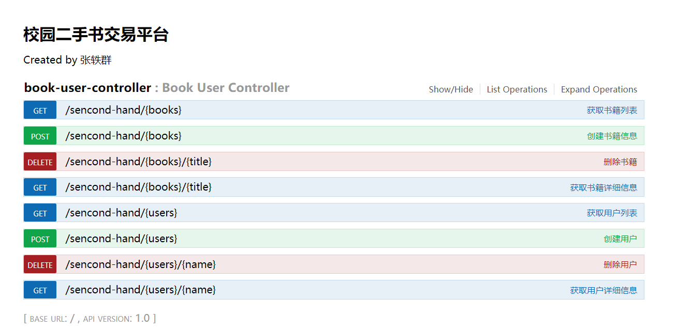
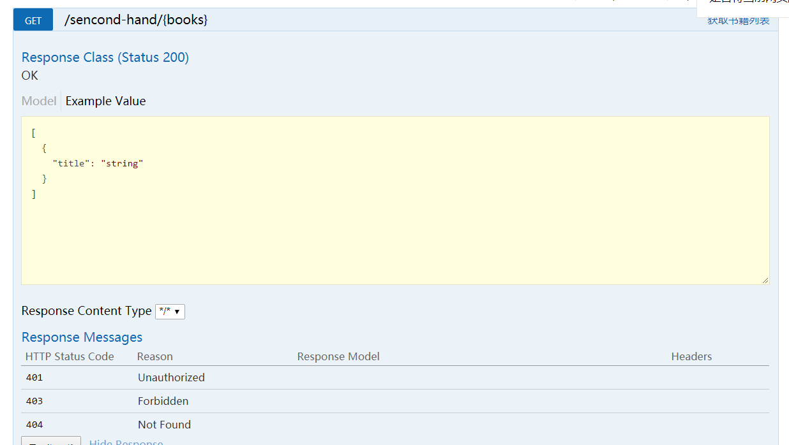
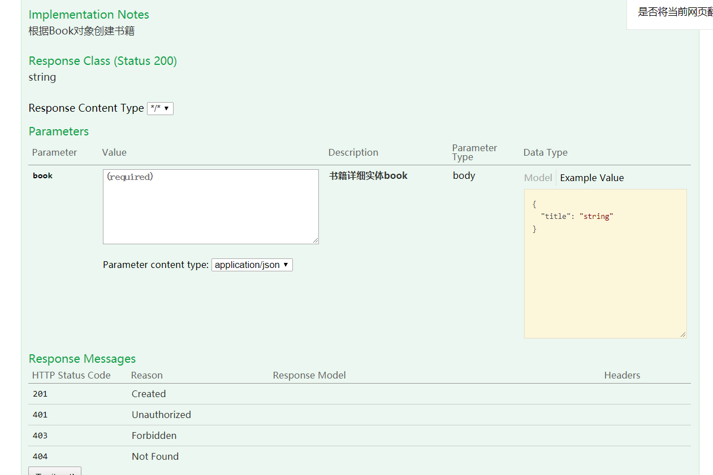
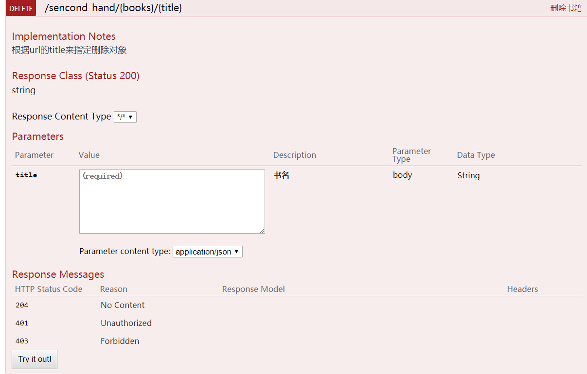
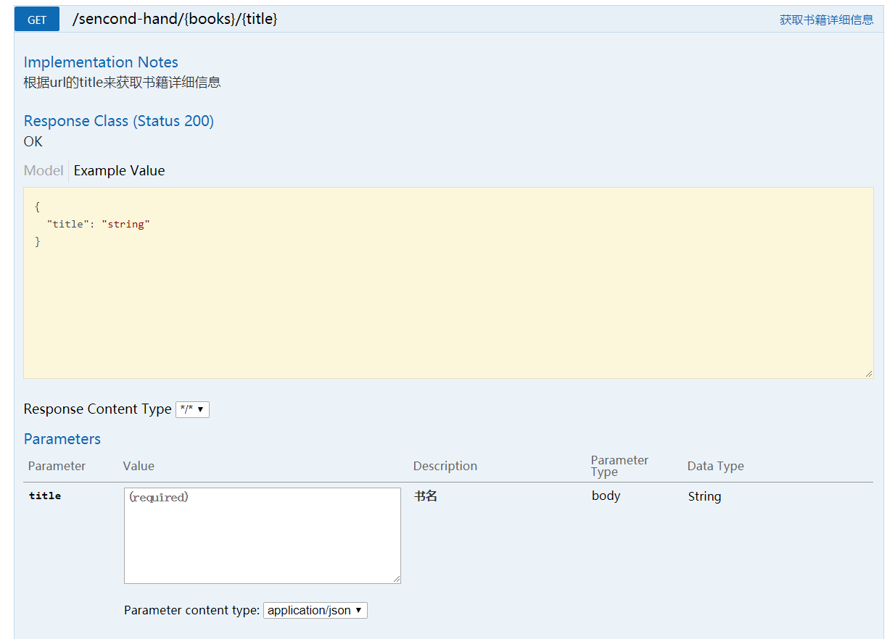
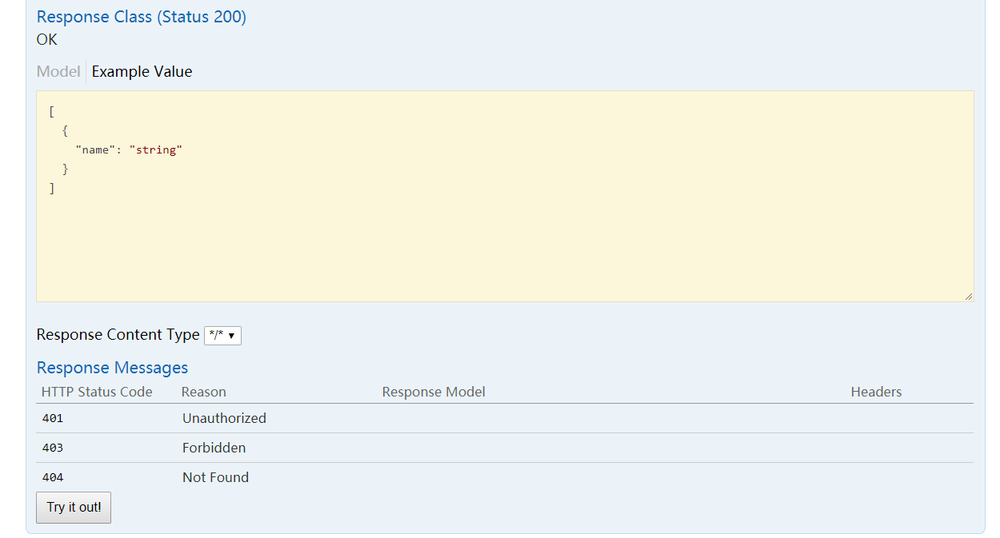
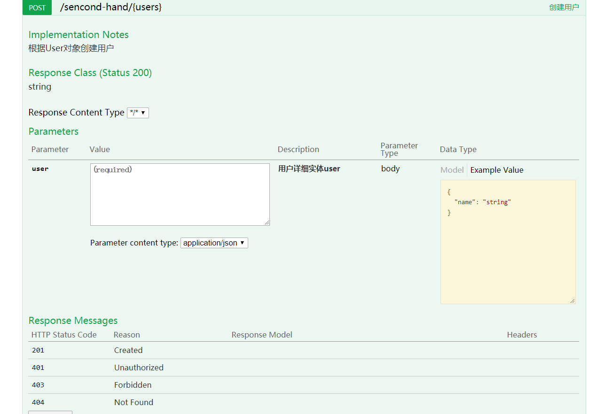
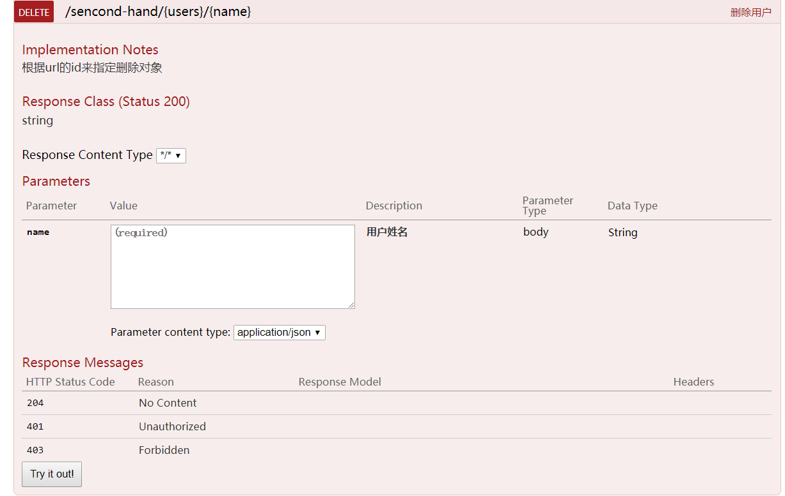
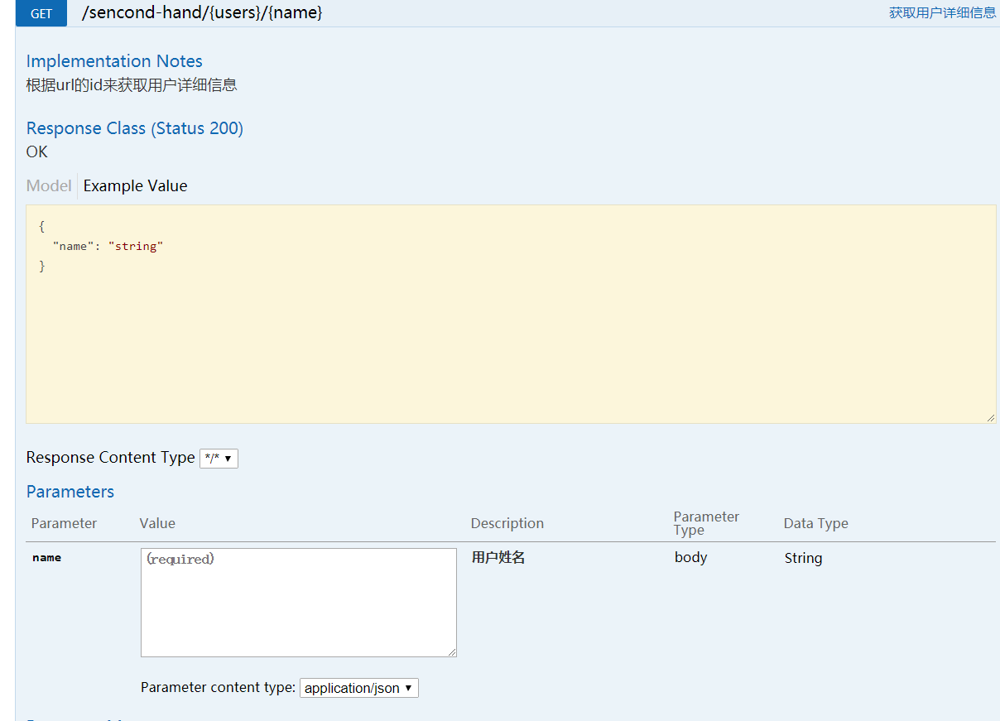

# 三、Web服务开发实验

## 1. 实现功能

本次实验使用的是REST方法，一共实现了八个接口，具体如下：

### 1.1 获取书籍列表

处理"/{books}/"的GET请求，用来获取书籍列表

```java
@ApiOperation(value = "获取书籍列表", notes = "")
@RequestMapping(value = {"/{books}"}, method = RequestMethod.GET)
public List<Book> getBookList() {
        List<Book> b = new ArrayList<Book>(books.values());
        return b;
}
```

### 1.2 创建书籍信息

处理"/{books}/"的POST请求，用来创建Book

```java
@ApiOperation(value = "创建书籍信息", notes = "根据Book对象创建书籍")
@ApiImplicitParam(name = "book", value = "书籍详细实体book", required = true, dataType = "Book")
@RequestMapping(value = "/{books}", method = RequestMethod.POST)
public String postBook(@RequestBody Book book) {
    books.put(book.getTitle(), book);
    return "success";
}
```

### 1.3 删除书籍

处理"/{books}/{title}"的DELETE请求，用来删除Book

```java
@ApiOperation(value = "删除书籍", notes = "根据url的title来指定删除对象")
@ApiImplicitParam(name = "title", value = "书名", required = true, dataType = "String")
@RequestMapping(value = "/{books}/{title}", method = RequestMethod.DELETE)
public String deleteBook(@PathVariable String title) {
    books.remove(title);
    return "success";
}
```

### 1.4 获取书籍详细信息

处理"/{books}/{title}"的GET请求，用来获取url中title值的Book信息

```java
@ApiOperation(value = "获取书籍详细信息", notes = "根据url的title来获取书籍详细信息")
@ApiImplicitParam(name = "title", value = "书名", required = true, dataType = "String")
@RequestMapping(value = "/{books}/{title}", method = RequestMethod.GET)
public Book getBook(@PathVariable String title) {
    return books.get(title);
}
```

### 1.5 获取用户列表


处理"/{users}/"的GET请求，用来获取用户列表


```java
@ApiOperation(value = "获取用户列表", notes = "")
@RequestMapping(value = {"/{users}"}, method = RequestMethod.GET)
public List<User> getUserList() {
    List<User> r = new ArrayList<User>(users.values());
    return r;
}
```

### 1.6 创建用户

处理"/{users}/"的POST请求，用来创建User

```java
@ApiOperation(value = "创建用户", notes = "根据User对象创建用户")
@ApiImplicitParam(name = "user", value = "用户详细实体user", required = true, dataType = "User")
@RequestMapping(value = "/{users}", method = RequestMethod.POST)
public String postUser(@RequestBody User user) {
    users.put(user.getName(), user);
    return "success";
}
```

### 1.7 删除用户

处理"/{users}/{name}"的DELETE请求，用来删除User

```java
@ApiOperation(value = "删除用户", notes = "根据url的id来指定删除对象")
@ApiImplicitParam(name = "name", value = "用户姓名", required = true, dataType = "String")
@RequestMapping(value = "/{users}/{name}", method = RequestMethod.DELETE)
public String deleteUser(@PathVariable String name) {
    users.remove(name);
    return "success";
}
```

### 1.8 获取用户详细信息

处理"/{users}/{name}"的GET请求，用来获取url中name值的User信息

```java
@ApiOperation(value = "获取用户详细信息", notes = "根据url的id来获取用户详细信息")
@ApiImplicitParam(name = "name", value = "用户姓名", required = true, dataType = "String")
@RequestMapping(value = "/{users}/{name}", method = RequestMethod.GET)
public User getUser(@PathVariable String name) {
    return users.get(name);
}
```

## 2. 实现效果

通过swagger-ui生成的页面



获取书籍列表



创建书籍信息



删除书籍



获取书籍详细信息



获取用户列表



创建用户



删除用户



获取用户详细信息

